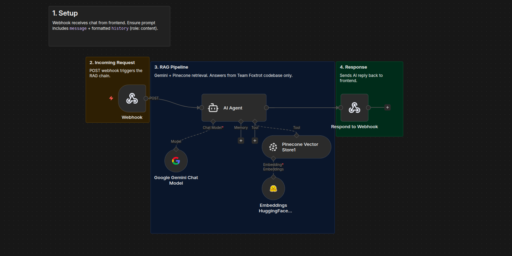
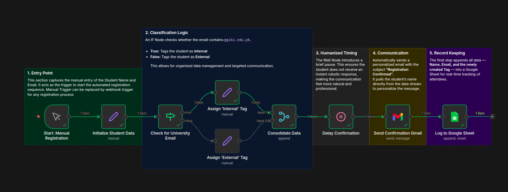

# n8n Workflows Collection

A collection of major n8n workflows I've created for automation, AI agents, and integrations.

---

## 🦊 FoxBrain AI Agent

**RAG-Powered Knowledge Assistant for Team Foxtrot GIKI**

An AI chatbot that helps freshers understand Team Foxtrot's codebase by searching through GitHub repositories and answering questions using Gemini LLM + Pinecone vector search.

**Tech:** n8n, Google Gemini, Pinecone, HuggingFace, React, Supabase

### Workflows

#### RAG Agent

#### Data Ingestion (Parent-Child)
Crawls all repos from GitHub org and embeds files into Pinecone.

#### Google Drive Ingestion

---

## 💰 NayaPay Ledger - Automated Expense Tracker

Automatically logs NayaPay SMS transactions to Google Sheets using AI-powered data extraction.

**Flow:** Phone (MacroDroid) → Webhook → Gemini AI → Google Sheets

**Tech:** n8n, AWS EC2, Terraform, Google Gemini, Google Sheets

---

## 📧 Event Auto Confirmation

Automates event registration by classifying attendees (Internal/External based on email), sending personalized confirmation emails, and logging to Google Sheets.

**Tech:** n8n, Gmail API, Google Sheets

---

## 🔗 ClickUp Discord Integration

> 🚧 **Under Development**

Bi-directional integration between ClickUp and Discord - notifies team members via Discord DM when tasks are assigned, and provides an AI assistant to fetch tasks.

**Tech:** n8n, ClickUp API, Discord Bot, Google Gemini

---

## 📄 License

See [LICENSE](LICENSE) file.
