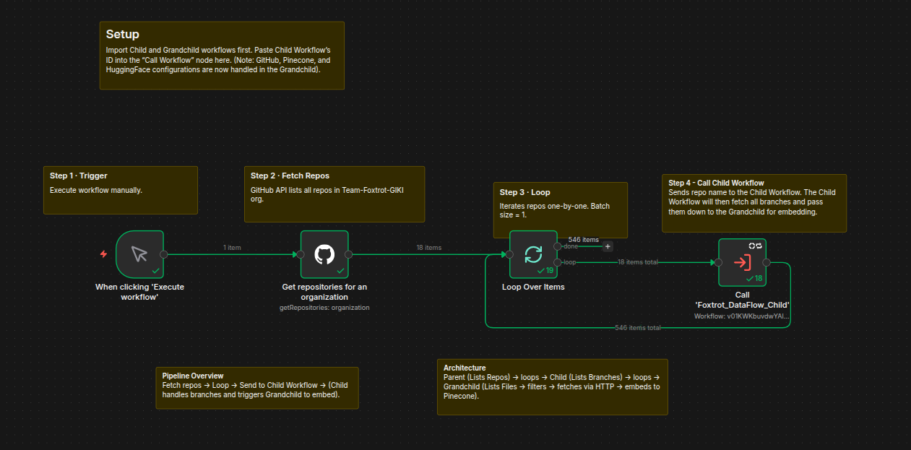
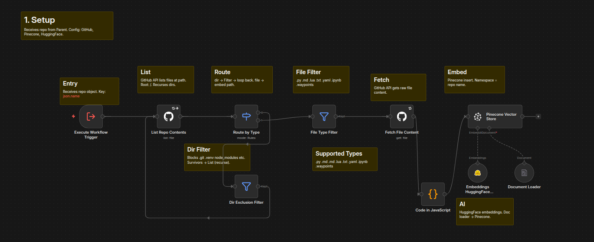
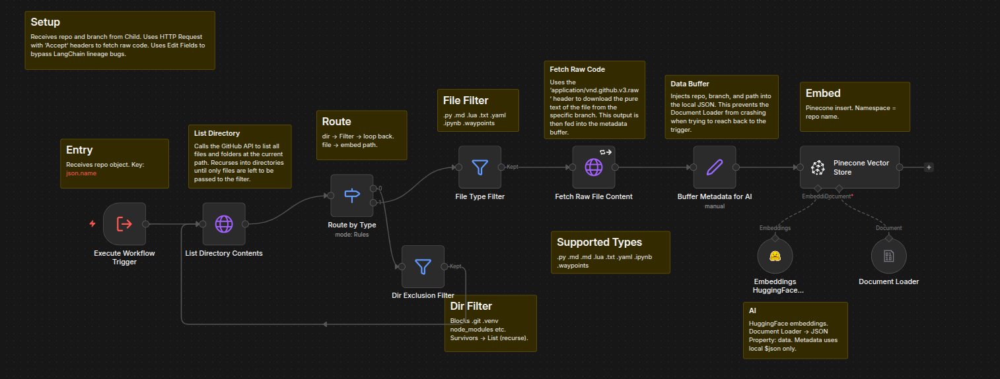
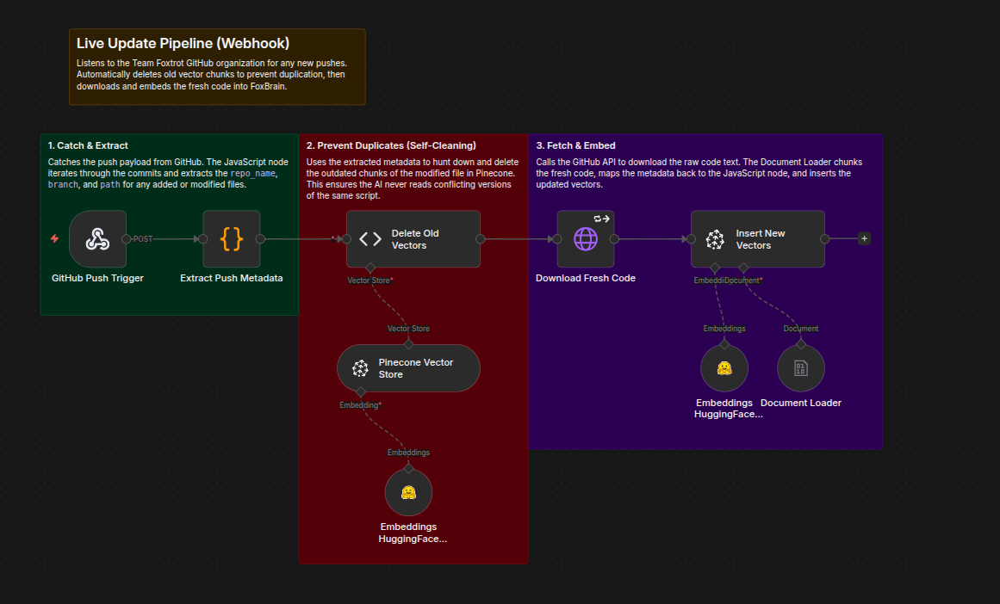
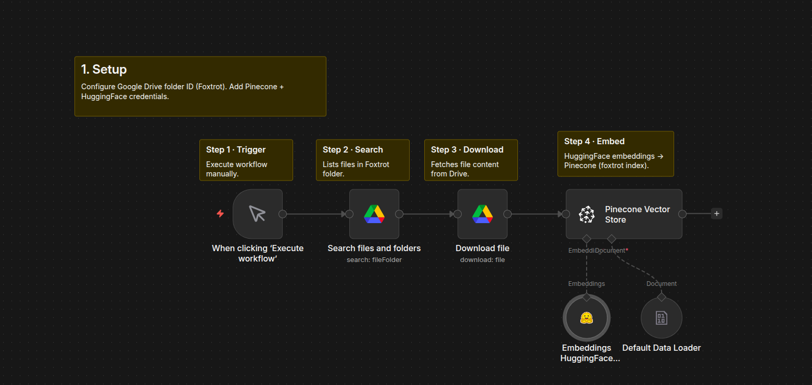
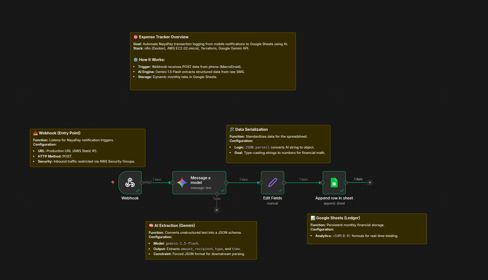

# n8n Workflows Collection

A collection of major n8n workflows I've created for automation, AI agents, and integrations.

---

## 🦊 FoxBrain AI Agent

**RAG-Powered Knowledge Assistant for Team Foxtrot GIKI**

An AI chatbot that helps freshers understand Team Foxtrot's codebase by searching through GitHub repositories and answering questions using Gemini LLM + Pinecone vector search.

**Tech:** n8n, Google Gemini, Pinecone, HuggingFace, React, Supabase

### Workflows

#### RAG Agent
The main chat interface - receives user messages via webhook, retrieves relevant context from Pinecone, and generates answers using Gemini.


#### Data Ingestion Pipeline (Parent → Child → GrandChild)

A three-tier workflow architecture that crawls **all branches** (not just main) from every repository in the GitHub organization and embeds files into Pinecone.

**Architecture:**
```
Parent (Lists Repos) → Child (Lists Branches) → GrandChild (Fetches & Embeds Files)
```

**Parent Workflow** — Fetches all repositories from the Team-Foxtrot-GIKI GitHub org and loops through each, calling the Child workflow.



**Child Workflow** — Receives a repo name, fetches all branches for that repo via GitHub API, and loops through each branch calling the GrandChild with repo + branch info.



**GrandChild Workflow** — Receives repo name and branch name, recursively lists directory contents, filters supported file types (`.py`, `.md`, `.lua`, `.txt`, `.yaml`, `.ipynb`, `.waypoints`), fetches raw file content, and embeds into Pinecone with full metadata (repo, branch, file path).



#### Live GitHub Commit Sync
Automatically keeps the knowledge base up-to-date. When new commits are pushed to any repo, this workflow triggers via webhook, deletes outdated vectors from Pinecone, and embeds the fresh code - ensuring FoxBrain always has the latest codebase.



#### Google Drive Ingestion
Ingests documentation files from Google Drive into the vector database.



---

## 💰 NayaPay Ledger - Automated Expense Tracker

Automatically logs NayaPay SMS transactions to Google Sheets using AI-powered data extraction.

**Flow:** Phone (MacroDroid) → Webhook → Gemini AI → Google Sheets

**Tech:** n8n, AWS EC2, Terraform, Google Gemini, Google Sheets



---

## 📧 Event Auto Confirmation

Automates event registration by classifying attendees (Internal/External based on email), sending personalized confirmation emails, and logging to Google Sheets.

**Tech:** n8n, Gmail API, Google Sheets


---

## 🔗 ClickUp Discord Integration

> 🚧 **Under Development**

Bi-directional integration between ClickUp and Discord - notifies team members via Discord DM when tasks are assigned, and provides an AI assistant to fetch tasks.

**Tech:** n8n, ClickUp API, Discord Bot, Google Gemini

---

## 📄 License

See [LICENSE](LICENSE) file.
